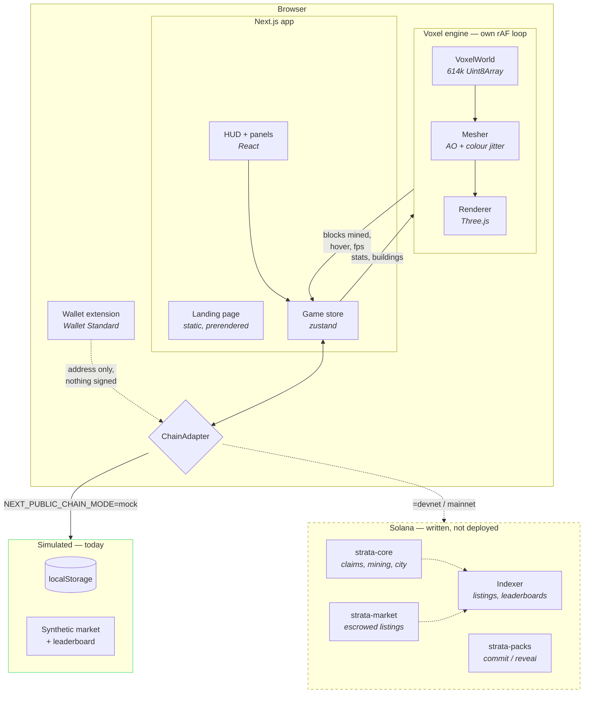

# Architecture

## The shape of the thing

Four layers, with a hard rule about which way dependencies point:

```
ui/  ──────►  sim/  ◄──────  onchain/
 │             ▲                 │
 │             │                 │
 └──────►  game/  ────────────────┘
              (game never imports onchain or ui)
```

- **`sim/`** is the bottom. Pure functions and data tables: what a resource is worth, how
  much energy a swing costs, what a crate can contain. No I/O, no rendering, no React. It
  is the only place a game rule is written down, which is what lets the same rule run in
  the browser for prediction and in a program for settlement.
- **`game/`** is the voxel engine. It imports `sim/` for rules and knows nothing about
  React, the chain, or the UI. It can be driven from a test with no canvas.
- **`onchain/`** is the seam. One interface, two implementations, and nothing above it
  knows which one is live.
- **`ui/`** is everything visible. It talks to `onchain/` through a hook and to `game/`
  through an imperative handle.

The rule that keeps this honest: **no UI file may import an adapter implementation
directly.** They consume `useChain()` and get whichever one the environment selected.

## Runtime picture



The dashed path is the part that does not exist yet. Everything solid works today.

## The engine, in detail

### Storage

The claim is **bounded** — 80 × 96 × 80 voxels — so the whole world is one flat
`Uint8Array` rather than a hash map of chunks. That single decision removes every
chunk-boundary special case from the mesher and the raycaster: a neighbour lookup is a
bounds check and an array read.

Index order is `y + H * (x + W * z)`, so vertical runs are contiguous. Worldgen fills
column by column, extractors bore straight down, and the raycaster spends most of its
steps travelling vertically. Chunks (16³, 150 of them) exist only to partition meshing.

### Meshing

There are no textures. Three effects carry the entire look, and they compound:

1. **Directional face shading** — a fixed brightness per face direction. Free, and most
   of why a cube reads as a cube.
2. **Per-vertex ambient occlusion** — the dark creases where blocks meet. The single
   biggest visual upgrade available to a voxel renderer, and it costs nothing at runtime
   because it bakes into vertex colours.
3. **Per-voxel colour jitter** — a hash-driven nudge per voxel. Without it, a wall of 400
   stone blocks is one flat grey rectangle.

Output is indexed geometry — four vertices and six indices per quad instead of six
vertices. Quads split along their brighter diagonal, or the AO gradient visibly bends
along the shared edge.

Only chunks whose voxels changed are rebuilt, and rebuilds are time-budgeted to ~6.5ms
per frame. A single mined block can dirty up to eight chunks, because AO reaches one
voxel diagonally across a boundary.

### Raycasting

Amanatides & Woo grid traversal, not a mesh raycast. Stepping a uniform grid is exact and
far faster than intersecting triangles — there is no geometry to test, and it cannot miss
a block at grazing angles the way a triangle raycast can.

### Scheduling

Worldgen and initial meshing yield through `MessageChannel`, not
`requestAnimationFrame`. Browsers stop firing rAF entirely in hidden tabs, so a player
who loads the page and switches away would come back to a loading bar frozen forever.
`setTimeout` survives that but gets clamped to ~1s per call in background tabs.
`MessageChannel` is neither throttled nor clamped, and its callbacks are macrotasks, so
the browser still gets to paint between slices. See
[`src/lib/schedule.ts`](../src/lib/schedule.ts).

## The chain seam

```ts
interface ChainAdapter {
  kind: "mock" | "solana";
  connect(walletName?: string): Promise<WalletState>;
  getSnapshot(owner: Address): Promise<PlayerSnapshot | null>;
  settleMining(bag: ResourceBag, energySpent: number): Promise<TxReceipt<...>>;
  commitPack(kind: PackKind): Promise<TxReceipt<PackCommit>>;
  revealPack(commitId: string): Promise<TxReceipt<PackReveal>>;
  buyListing(id: ListingId): Promise<TxReceipt<...>>;
  // ...twenty-odd more
}
```

Four properties make the eventual swap cheap:

1. **Every mutating call returns a `TxReceipt`**, even in mock mode — signature, slot,
   block time, fee, and a `simulated: true` flag the UI surfaces. Signatures,
   confirmation states and explorer links are already rendered, so nothing needs
   retrofitting.
2. **The mock is slow.** Every call sleeps 150–900ms. A UI developed against an instant
   backend has no loading states, and adding them afterwards is miserable.
3. **The mock refuses.** Insufficient funds, missing prerequisites and bad state all
   throw `ChainError` with the same codes the Solana adapter uses.
4. **All amounts are `bigint` base units.** Never floats. `1.5 STRATA` is
   `1_500_000_000n`, exactly as SPL stores it.

`MockChainAdapter` also implements the *same* commit-reveal scheme the program will, so
the reveal UI, the published seeds and the verification panel are all real today.

## GitHub and Vercel

**Branches.** `main` is production. Feature branches open a PR; every PR gets a Vercel
preview deployment at its own URL. Nothing merges to `main` without a green typecheck,
lint and test run.

**Deploys.** Vercel builds from the repository root — the Next.js app is the repo root,
so there is no monorepo root-directory configuration to get wrong. `programs/` and
`docs/` are ignored by the build.

**Environment.** The production build needs no environment variables. With none set,
`resolveChainMode()` returns `mock` and the game runs. Setting
`NEXT_PUBLIC_CHAIN_MODE=devnet` without also setting `NEXT_PUBLIC_PROGRAM_ID` logs a
warning and falls back to mock rather than shipping something that throws on first render.

**CI.** `.github/workflows/ci.yml` runs typecheck, lint and tests on every push and pull
request. The Rust programs are checked separately because Anchor's toolchain is slow to
install and only matters when `programs/` actually changes.

## Where this goes next

Three things are load-bearing for an on-chain version and are deliberately not built yet:

- **An indexer.** `getListings` and `getLeaderboard` cannot be `getProgramAccounts` calls
  from a browser at any real scale. They need a service subscribed to program logs,
  writing to a database the client queries. The adapter interface already models these as
  paged queries, so the shape won't change.
- **Item custody.** Items are modelled with an `ItemId` that maps to a compressed NFT
  asset id. Choosing Bubblegum versus a packed inventory account is a real decision with
  cost and composability trade-offs; see [ONCHAIN.md](ONCHAIN.md).
- **Write batching.** A mining tick cannot be an L1 transaction. The current design
  already batches hand mining into one settlement every ~30 blocks or 12 seconds, which
  is the right shape; ephemeral rollups are the escape hatch if that isn't enough.
