# Economy

## The loop

```mermaid
flowchart LR
    E["Energy<br/><i>time, free</i>"] -->|hand mining| Ore
    Ore["Raw ore"] -->|smelter| Ingots["Refined goods<br/><i>~4x value</i>"]
    Ingots -->|sink| Currency["STRATA"]
    Ore -.->|"the trap:<br/>a quarter the value"| Currency

    Currency --> Buildings["Buildings<br/><i>sink</i>"]
    Currency --> Crates["Crates<br/><i>sink</i>"]
    Currency --> Market["Market buys<br/><i>fee burns</i>"]

    Buildings -->|passive output| Ore
    Crates --> Gear["Equipment"]
    Gear -->|"more yield per<br/>unit of energy"| E
    Market --> Gear
    Gear -.->|salvage| Currency

    style Currency fill:#2a1f0d,stroke:#ff9a2e
    style E fill:#0d2028,stroke:#36d6ec
```

Two inputs to the whole system: **time** (energy regeneration, extractor bores) and
**player attention** (hand mining, choosing what to build). Everything else is a transform
between them.

## Sources and sinks

Currency is created in exactly two places and destroyed in five. That asymmetry is the
point.

| | Flow | Notes |
| --- | --- | --- |
| **Source** | Selling resources to the sink | Fixed posted prices, not floating |
| **Source** | Crate bonus rolls | 6–22% chance depending on crate |
| **Sink** | Crate purchases | The largest sink by volume |
| **Sink** | Building placement and upgrades | Scales 1.7–2.0× per level |
| **Sink** | Market fees | 250bps, 40% of which is burned outright |
| **Sink** | Smelter rush fees | 8% of output value to skip the wait |
| **Sink** | Demolition loss | 60% of build cost, not returned |

Item salvage is neither: it converts an item back into currency at a rate below what the
crate cost, so a player who opens crates and salvages everything loses money steadily.
That is intentional — salvage is a **floor**, not a strategy.

### Why sink prices are fixed

A dynamic sink price that falls as supply rises sounds sophisticated. In practice it
punishes whoever logs in last, and it makes the game's income unpredictable in a way that
players experience as unfairness rather than as economics.

Price discovery is supposed to happen in the **player marketplace**, where it is a real
signal about what a roll is worth. The sink is a floor, and floors should not move.

## Tuning targets

These are the numbers the design is balanced around. They are targets, not measurements —
the game has not had real play data yet, and the honest expectation is that several of
them are wrong.

| Metric | Target | Rationale |
| --- | --- | --- |
| Time to first Generator | ~6 min | The first "the city works without me" moment must land in one sitting |
| Time to first Smelter | ~15 min | Long enough to feel earned, short enough to teach the refining lesson early |
| Hand-mining income at level 1 | ~40 STRATA/min | A Supply Crate is ~6 minutes of hand mining |
| Extractor payback (L1) | ~45 min | An extractor should pay for itself inside a session |
| Crate expected value vs price | 0.55–0.75× | Crates are a **sink**. Positive-EV crates are a money printer, not a game |
| Refining multiplier | 3.9–4.2× | Asserted in `economy.test.ts` |
| Storage pressure onset | ~20 min unattended | Long enough not to nag, short enough that Silos matter |

The crate ratio deserves emphasis. `expectedPackValue()` computes the average salvage
value of a crate's contents; it comes out well below the price for all three crates. That
is not a mistake to be corrected — a crate that returns more than it costs converts the
economy into an infinite currency source, and every idle game that has shipped one has
had to rewrite its economy afterwards.

## Anti-inflation

Four mechanisms, in rough order of how much load they carry:

1. **The offline window is capped at 7 days.** A claim left for a year does not settle a
   year of output in one transaction. Offline progress is a courtesy, not an entitlement,
   and an uncapped window is an inflation bug wearing a feature's clothes.
2. **Storage is a hard cap.** Production stops dead when the store is full. Without this,
   an idle claim generates unbounded value; with it, absence has diminishing returns and
   Silos have a reason to exist.
3. **Fee burning.** 40% of every market fee leaves circulation permanently. As trading
   volume grows — which is exactly when currency supply grows — so does the burn.
4. **Crate sinks scale with wealth.** The Deep Core Vault costs 20× the Supply Crate, so
   richer players have a proportionally larger place to spend.

## What this economy deliberately is not

It is a **closed loop with real sinks**, not a redistribution scheme.

There is no mechanism by which one player's spending becomes another player's yield.
Nobody earns because someone else joined, no position pays out from later deposits, and
there is no advantage to arriving early beyond having played for longer — the same
advantage as in any game with a level counter.

That is a design decision, not an oversight, and it is worth stating plainly because
"on-chain game economy" often means the opposite. A game whose returns depend on
recruitment is a wealth transfer from the people who arrive last, and it stops being fun
at exactly the moment it stops growing. This economy works the same on day one and day
one thousand, at ten players and ten thousand, because the only inputs are time and
attention.

## Progression pacing

Rough currency curve for a player who reinvests rather than hoards:

| Session | Cumulative earned | Typically holds |
| --- | ---: | --- |
| First 10 min | ~400 | Generator, mining by hand |
| First hour | ~4,000 | Habitat, Smelter, 2 Extractors, a few Supply Crates |
| ~5 hours | ~40,000 | Market Hub, 4–5 Extractors, Prospector Cases, first real gear |
| ~20 hours | ~350,000 | Assay Lab, level 3–4 buildings, Deep Core Vaults, trading actively |

The curve is intentionally steep early and flattening later: the first hour has to prove
the loop works, and after that the interesting decisions are about layout and trading
rather than raw accumulation.

## Where to look when tuning

| Change | File |
| --- | --- |
| Resource values, recipes | `src/sim/resources.ts` |
| Building costs, output, crew, power | `src/sim/buildings.ts` |
| Energy, mining speed, XP, production | `src/sim/economy.ts` |
| Crate prices, drop tables, luck | `src/sim/packs.ts` |
| Item archetypes and stat ranges | `src/sim/items.ts` |
| Ore distribution by depth | `src/sim/strata.ts` |

Every one of those has an assertion in `src/sim/economy.test.ts` guarding the invariant it
is supposed to preserve. Change a number, run `npm test`, and the suite will tell you if
you broke a design promise rather than just a value.
